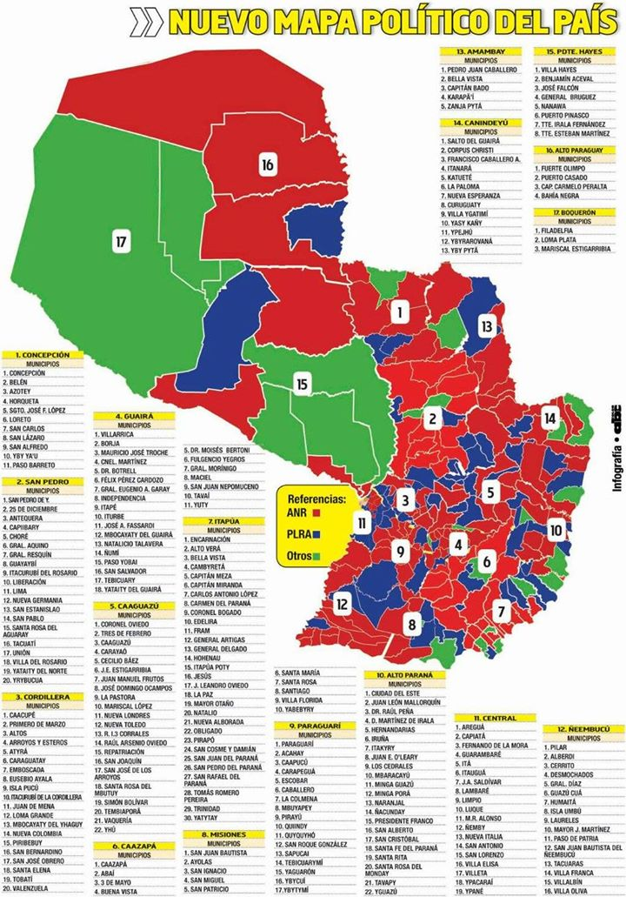

En las elecciones municipales del domingo pasado se eligieron intendentes y concejales en los 250 distritos que conforman Paraguay.<!--more--> El primer dato que arrojaron las elecciones, antes de iniciarse, fue precisamente ese número: 250, la cantidad de municipios. En las elecciones de 2010 había 238: 12 menos. En las de 2006 había 230: 8 menos. Podemos decir: la geografía política distrital es dinámica.

El Partido Colorado (ANR) presentó candidatos en todos los distritos. El Partido Liberal (PLRA) se presentó en 200. Lo siguió el Frente Guasú, en 86, y el UNACE en 68.

Esto es hasta cierto punto engañoso, ya que liberales y miembros del Frente Guasú se presentaron en muchos distritos en partidos o alianzas con otro nombre. Los liberales tienen presencia en prácticamente todo el territorio, salvo en como mucho 25 distritos. En cambio, hay 97 distritos (un 39%) en los que el Frente Guasú no tiene presencia, ni siquiera a través de posibles aliados, si no entra en alianza con el PLRA. Es decir, hay 97 distritos en los que para el Frente Guasú es indispensable aliarse al PLRA. Esos distritos concentran un 23% de la población.

El siguiente gráfico muestra cuántos candidatos se presentaron en cada distrito:

La anécdota: hubo 5 distritos en los que sólo se presentó un candidato. Fue, en todos los casos, colorado. En esos distritos el porcentaje de participación fue sólo levemente más bajo que el promedio nacional (50.5% frente al 56.6% nacional). Hubo más voto en blanco y nulo, pero no demasiado: 17.8% contra 5%.

Descontemos los casos anecdóticos. El promedio es 2.98: en la mayoría de los distritos (un 57%) se presentaron 3 o más candidatos.

¿Cómo quedó el mapa político? Así:

Lo que se observa en el gráfico anterior es que en cantidad de habitantes el Partido Colorado sólo gobierna al 51% (descontando que tiene la presidencia), mientras que el Partido Liberal gobierna al 34%. Si sumamos Asunción (donde ganó el Partido Revolucionario Febrerista, encabezado por el PLRA), alcanza un 41%. Sólo 10 puntos por debajo de la ANR.

Notar también que el UNACE, con sus 3 intendencias, está tercero, pero sólo gobierna al 0.3% de la población. El Frente Guasú está peor aún: el mismo 0.3% con una intendencia menos.

Si contamos la cantidad total de votos recibidos por cada partido, el Partido Colorado queda debajo del 50%: sólo obtuvo el 48.2% de los votos totales. El PLRA sumando Asunción obtuvo el 39.7%. De nuevo 10 puntos de diferencia. El Frente Guasú en soledad quedó tercero (descontando Asunción) con el 2.7% de los votos, seguido por el UNACE y su 1.1%.

El Frente Guasú en soledad, librado a la lucha cuerpo a cuerpo por el territorio, es un partido de un dígito, como el trotskismo en Argentina. Y sin embargo el próximo presidente puede salir de ese Frente. Contar intendentes y pintar mapas nos dice algo: sin la ayuda del PLRA ese objetivo es imposible. Pero no hay que dejar de lado el primer número que mencioné: el mapa también cambia.

Fuentes:

* Los resultados los tomé de [acá](http://resultados.tsje.gov.py/divulgacion.html).
* Los números de habitantes de cada distrito los tomé de [acá](https://es.wikipedia.org/wiki/Anexo:Ciudades_de_Paraguay_por_poblaci%C3%B3).
* La cantidad de distritos en 2006 y 2010 salió de [acá](http://tsje.gov.py/elecciones-municipales-2006.html).
* El mapa político fue publicado por [ABC](http://www.abc.com.py/).
* Mis gráficos fueron hechos con [Highcharts](http://www.highcharts.com/).

PD: [Pablo Touzon](http://panamarevista.com/2015/11/19/el-dron-del-politologo/) escribió un comentario sobre este tipo de análisis (incluyendo algunos infinitamente más sofisticados) que me parece pertinente.

